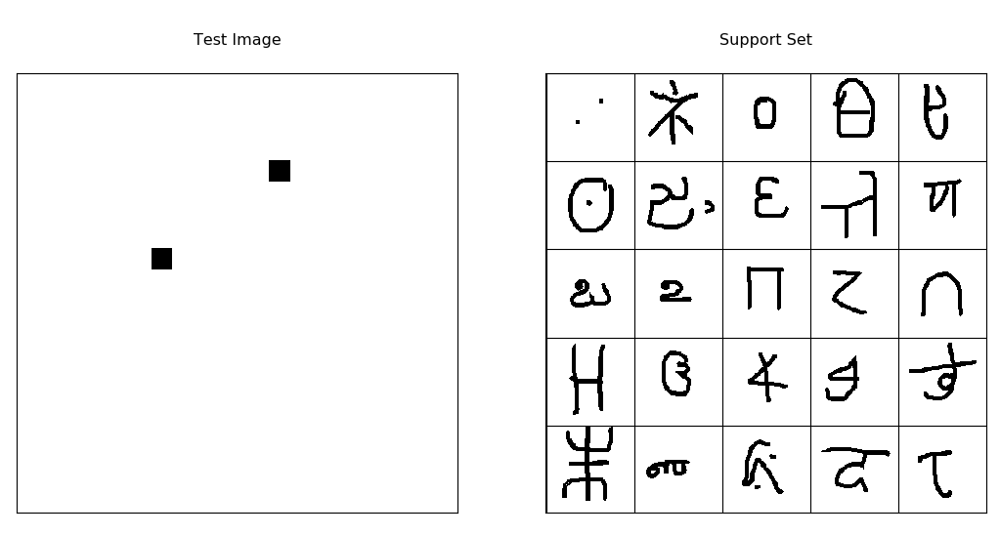

# one_shot_siamese

[koch et al, Siamese Networks for one-shot learning,](https://www.cs.cmu.edu/~rsalakhu/papers/oneshot1.pdf)  (mostly) reimplimented in keras. 
Trains on the [Omniglot dataset]( https://github.com/brendenlake/omniglot).


## Installation Instructions


To run, you'll first have to clone this repo and install the dependencies

```bash
git clone https://github.com/GopiKishan14/one_shot_siamese
cd one_shot_siamese
sudo pip install -r requirements.txt

```


Then you'll need to download the omniglot dataset and preprocess/pickle it with the load_data.py script.
```bash
git clone https://github.com/brendenlake/omniglot
python load_data.py --path <PATH TO THIS FOLDER>
```
Then you can run the jupyter notebook. If you used python2 to load the data, make sure you use a python2 kernel in your jupyter notebook and vice versa. It's also a good idea to make sure you're using the latest versions of keras and tensorflow.
```bash
jupyter notebook
```

